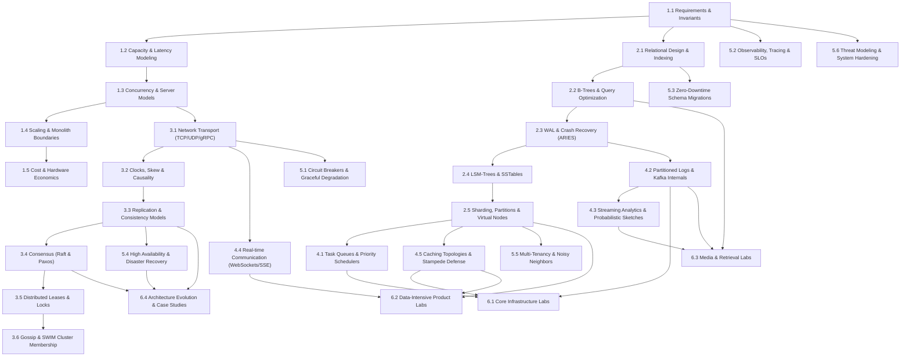

# Curriculum Dependency Graph

This document establishes the conceptual prerequisite graph underpinning Curriculum v2. Units are ordered based on architectural necessity—a learner must understand the foundational mechanism before analyzing the distributed abstraction built upon it.

---

## High-Level Dependency Graph

---

## Detailed Prerequisite Sequence by Track

### Track 1: Foundations & Workload Modeling
- `requirements-clarification` (None)
- `back-of-the-envelope-capacity-planning` (Prerequisite: `requirements-clarification`)
- `concurrency-vs-parallelism` (Prerequisite: `back-of-the-envelope-capacity-planning`)
- `horizontal-vs-vertical-scaling` (Prerequisite: `concurrency-vs-parallelism`)
- `cost-aware-architecture` (Prerequisite: `horizontal-vs-vertical-scaling`)

### Track 2: Data Architecture & Storage Internals
- `relational-database-design` (Prerequisite: `requirements-clarification`)
- `database-indexing` & `b-tree` (Prerequisite: `relational-database-design`)
- `database-wal-and-recovery` (Prerequisite: `b-tree`)
- `lsm-tree-storage-engine` (Prerequisite: `database-wal-and-recovery`)
- `sharding-and-partitioning` & `consistent-hashing` (Prerequisite: `lsm-tree-storage-engine`)

### Track 3: Distributed Systems & Consensus
- `tcp-vs-udp` & `http-rest-grpc` (Prerequisite: `concurrency-vs-parallelism`)
- `clocks-and-ordering` & `consistency-models` (Prerequisite: `tcp-vs-udp`)
- `cap-and-pacelc` & `replication` (Prerequisite: `consistency-models`)
- `consensus` & `leader-election` (Prerequisite: `cap-and-pacelc`)
- `distributed-locks-and-leases` & `gossip-protocol` (Prerequisite: `consensus`)

### Track 4: Asynchronous Execution, Queues & Real-Time
- `delegation-and-async-work` & `task-queue-vs-event-stream` (Prerequisite: `sharding-and-partitioning`)
- `event-bus-for-product-events` & `partitioned-log-system-design` (Prerequisite: `task-queue-vs-event-stream`)
- `caching-layers` & `cache-concurrency-control` (Prerequisite: `consistent-hashing`)
- `hyperloglog-cardinality-estimation` & `count-min-sketch` (Prerequisite: `delegation-and-async-work`)
- `websockets-vs-sse-vs-long-polling` (Prerequisite: `tcp-vs-udp`)

### Track 5: Production Engineering & Resilience
- `circuit-breakers-and-timeouts` & `load-shedding` (Prerequisite: `distributed-systems-foundations`)
- `observability-for-distributed-systems` & `slos-and-error-budgets` (Prerequisite: `non-functional-requirements`)
- `database-migration-safety` & `parallel-monolith-read-drain` (Prerequisite: `relational-database-scaling`)
- `disaster-recovery` & `database-backups-and-restore` (Prerequisite: `replication`)
- `multi-tenant-design` & `security-and-abuse-prevention` (Prerequisite: `requirements-clarification`)

### Track 6: Systems Design Labs & Architectural Evolution
- `url-shortener-system-design` (Prerequisites: Tracks 1, 2)
- `sliding-window-rate-limiter` (Prerequisites: Tracks 1, 4)
- `chat-and-messaging-system-design` (Prerequisites: Tracks 2, 3, 4)
- `case-amazon-dynamo` (Prerequisites: Tracks 2, 3)
- `case-discord-message-storage` (Prerequisites: Tracks 2, 4)
- `case-gitlab-database-incident` (Prerequisites: Tracks 2, 5)
