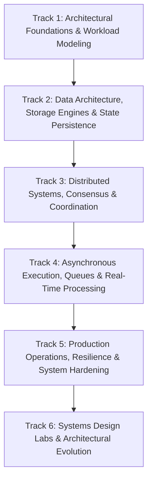

# Learning Philosophy & Pedagogical Framework

**Project:** System Design in Depth  
**Version:** 2.0.0 (Dependency-Driven Architecture)

---

## 1. Core Educational Principles

System design is often taught superficially as a collection of buzzwords ("put Redis in front of PostgreSQL, add Kafka for messaging"). This platform rejects flashcard-style learning in favor of first-principles mechanical reasoning.

### Principle 1: Invariants Before Technologies
Before choosing an infrastructure component, an engineer must articulate the **invariants** that cannot be violated:
- Which operations must be linearizable versus eventually consistent?
- Which state transitions must be idempotent?
- What are the non-negotiable recovery point objectives (RPO) and recovery time objectives (RTO)?

A technology choice (e.g. Cassandra, DynamoDB, Kafka) is merely an implementation detail that embodies a specific set of trade-offs against these invariants.

### Principle 2: Hardware Realities & Latency Numbers
Distributed systems do not run on abstract diagrams; they run on physical servers, network links, NVMe drives, and Linux kernels. Every architectural decision is grounded in real constraints:
- Cache hierarchies, CPU cache-line false sharing, and memory access latency.
- Sequential versus random disk I/O (B-Trees versus LSM-Trees).
- Cross-region round-trip times (speed-of-light propagation) and packet loss.

### Principle 3: Failure as the Steady State
At scale, failure is not an exceptional event; it is continuous. Components fail, network partitions occur, clocks drift, and processes crash. Systems must be designed for graceful degradation, backpressure, bulkheading, and automated recovery.

### Principle 4: Build It to Understand It
Passive reading produces an illusion of competence. Learners solidify concepts through:
1. **Interactive Visual Simulators:** Manipulating parameters (e.g., Raft timeouts, quorum sizing, cache stampede mitigation) to see edge cases unfold in real time.
2. **From-Scratch Builds:** Implementing the core algorithms (WAL, LSM-Tree, Bloom filter, Consistent Hashing) in minimal, dependency-free code with automated test suites.

---

## 2. Pedagogical Progression

The curriculum is structured strictly by **conceptual dependencies**, not by arbitrary topic counts:

1. **Foundations:** How a single server executes requests, handles concurrency, and models capacity.
2. **Data & Storage Engines:** How state is committed to disk, indexed, and retrieved on a single node before distributing it.
3. **Distributed Coordination:** How multiple nodes agree on time, order, state, and leadership despite network partitions.
4. **Asynchronous Execution:** Decoupling producers from consumers via event logs, streaming analytics, and caching.
5. **Production Operations:** Hardening systems against cascading failures, managing migrations, and defending multi-tenant boundaries.
6. **Design Labs & Evolution:** Synthesizing these building blocks into end-to-end production architectures and learning from historical postmortems.
