```mermaid
flowchart TD
    subgraph IngestionPipeline ["1. Ingestion & Index Construction"]
      RawDocs["Raw Documents (Arbitrary Corpus)"] --> Tokenizer["Tokenizer & Normalizer"]
      Tokenizer --> Stemmer["Porter Suffix Stemming"]
      Stemmer --> Postings["Sorted Postings Lists (DocID + TF + Positions)"]
      Postings --> DeltaComp["Delta + Variable Byte Compression"]
      Postings --> ChampBuild["Tier 1 Champion Lists (Top-K PageRank)"]
    end

    subgraph QueryPipeline ["2. Online Query Serving"]
      UserQuery["User Query: 'distributed consensus'"] --> QTok["Query Tokenizer"]
      QTok --> QueryPlan{"Matches in Tier 1?"}
      QueryPlan -->|"Yes (sub-5ms)"| Ranker["Okapi BM25 Ranking Formula"]
      QueryPlan -->|"No"| Cascade["Cascade to Tier 2 Full Archive"]
      Cascade --> Ranker
      Ranker --> TopResults["Top-K Scored Results"]
    end
```

# Building an Inverted Index Search Engine from Scratch

A comprehensive engineering masterclass on constructing a full-text search engine from first principles.

This build accompanies the video tutorial [*"Inverted Index - The Data Structure Behind Search Engines"*](https://www.youtube.com/watch?v=iHHqnyThrqE) and the architectural breakdown [*"BM25: The Information Retrieval Algorithm That Outlived Its Era"*](https://arpitbhayani.me/blogs/bm25/) by Arpit Bhayani.

---

## 1. Architectural Overview & The Core Problem

Traditional relational databases store records by Document ID (`DocID → Fields`). When evaluating a full-text search query such as:
```sql
SELECT * FROM documents WHERE content LIKE '%consensus%';
```
The database must execute a full table scan across all `N` documents (`O(N)` execution time). At a million documents with 10 KB per document, every single search query would read 10 GB of data from disk into memory.

An **Inverted Index** reverses this layout into a term-centric dictionary:

```
Forward Index:  Doc 1 ──► ["raft", "consensus", "replicated"]
                Doc 2 ──► ["consistent", "hashing", "nodes"]
                Doc 3 ──► ["raft", "consensus", "state"]

Inverted Index: "consensus"  ──► [ Doc 1, Doc 3 ]   <── Postings List (strictly sorted)
                "hashing"    ──► [ Doc 2 ]
                "raft"       ──► [ Doc 1, Doc 3 ]
```



---

## 2. The Document Ingestion Pipeline

Text cannot be indexed directly. If Document 1 contains `"Consensus!"` and Document 2 contains `"consensus,"`, a naive equality check fails. Raw text must pass through three normalization stages:

### Step 2.1: Case Folding & Punctuation Stripping
Input text is converted to lowercase and non-alphanumeric characters are stripped. Whitespace is collapsed into single delimiter spaces:
```javascript
const cleaned = text.toLowerCase().replace(/[^a-z0-9\s]/g, ' ').trim();
```

### Step 2.2: Stop-Word Elimination
Ubiquitous grammatical words (`the`, `is`, `at`, `and`, `to`) appear in almost every document. They carry near-zero information entropy while inflating index memory.

> [!NOTE]
> Early search engines aggressively stripped all stop words. Modern search engines retain stop words for phrase and positional lookups (e.g. *"To be or not to be"* or the band *"The Who"*), but assign them near-zero weight using inverse document frequency (IDF).

### Step 2.3: Algorithmic Suffix Stemming
Users searching for `"searched"` or `"searching"` expect documents containing `"search"` to match. We apply a Porter-style morphological suffix reduction:
- `ies` → `y` (e.g. `cities` → `city`)
- `sses` → `ss` (e.g. `dresses` → `dress`)
- `ing` → root (e.g. `running` → `runn`)
- `ed` → root (e.g. `searched` → `search`)
- `es` → root (e.g. `searches` → `search`)
- `s` → root (e.g. `dogs` → `dog`)

---

## 3. The Anatomy of a Production Postings List

In production engines (Apache Lucene, Elasticsearch), a postings list is not merely an array of integers. Each entry records:
1. **Document ID (`DocID`):** Strictly sorted in ascending order (`[1, 4, 12, 99]`).
2. **Term Frequency (`tf`):** The number of times the term appears within the document (used for BM25 ranking).
3. **Word Positions (`positions`):** The token offsets where the term occurred (used for exact phrase searches and snippet highlighting).
4. **Skip Pointers:** Pointers that leap forward past blocks of IDs (e.g. every 8 or 128 documents) to avoid linear scanning during intersections.

---

## 4. Set Intersection Algorithms (`O(N + M)`)

The strict ascending sorting invariant of document IDs enables two-pointer linear merge operations:

### Conjunction (Boolean AND)
Two cursors advance concurrently across sorted lists `A` and `B`:
- If `DocID_A == DocID_B`, record match and advance both cursors.
- If `DocID_A < DocID_B`, advance cursor `A`.
- If `DocID_A > DocID_B`, advance cursor `B`.

Complexity: **`O(N + M)`**, compared to `O(N × M)` in unindexed databases.

### The Rarest-First Heuristic
When evaluating multi-term queries (`distributed AND consensus AND raft`), we sort postings lists by length ascending (`df`) first. Intersecting the smallest list first dramatically shrinks intermediate candidate sets, slashing memory and CPU comparisons.

### Positional Exact Phrase Search
To evaluate exact phrase queries (`"distributed consensus"`):
1. Intersect document IDs to find documents containing both terms.
2. For matching documents, verify that a position of the second term immediately follows the first (`pos_B = pos_A + 1`).

---

## 5. Postings List Compression Engineering

Storing raw 32-bit integers for millions of document IDs consumes gigabytes of memory and swamps memory bandwidth:

### 1. Delta (Gap) Encoding
Because postings lists are strictly sorted, we replace absolute IDs (`[1000, 1004, 1008, 1020]`) with the differences between consecutive IDs (`[1000, 4, 4, 12]`). All deltas become small positive numbers.

### 2. Variable-Byte (VByte / VarInt) Compression
Standard 32-bit integers consume 4 bytes regardless of value. VByte encodes numbers into 7 bits per byte, reserving the 8th bit (MSB) as a continuation/termination flag:
- Values `< 128` consume only **1 byte** (a 75% immediate reduction).
- Values `< 16,384` consume **2 bytes** (a 50% reduction).

> [!TIP]
> Apache Lucene uses **Frame of Reference (FoR)** bit-packing for blocks of 128 integers, calculating the maximum bit-width required in each block to pack integers with zero wasted bits.

---

## 6. Scale & Tiered Architecture: Champion Lists

When serving millions of users, querying the full multi-gigabyte postings archive on every keystroke exhausts disk I/O.

Search engines partition documents into quality tiers:
- **Tier 1 (Hot In-Memory Core):** Maintains precomputed "Champion Lists" in RAM containing the top-`K` highest-authority documents per term (ranked by PageRank, click velocity, or document quality).
- **Tier 2 (Cold Disk Archive):** Stores complete postings lists on NVMe SSDs or persistent storage.

**Query Routing:** Queries first evaluate against Tier 1. If Tier 1 returns `≥ K` results (the common case for 90%+ of queries), the engine returns immediately with single-digit millisecond latency. Only when matches are insufficient does it cascade to Tier 2.

---

## 7. Relevance Ranking: Okapi BM25 Deep Dive

While TF-IDF laid the foundation for information retrieval, raw TF grows linearly: a document mentioning a keyword 500 times scores 50x higher than one mentioning it 10 times, making it vulnerable to keyword stuffing.

**Okapi BM25** (Best Matching 25) solves this with non-linear saturation:

```
BM25(D, Q) = Σ IDF(qᵢ) × [ (f(qᵢ, D) × (k₁ + 1)) / (f(qᵢ, D) + k₁ × (1 - b + b × (|D| / avgdl))) ]
```

### Key Parameters:
1. **Term Saturation Parameter `k₁` (Default: ≈ 1.2):** Controls how quickly the term frequency score saturates. As keyword occurrences increase, incremental score gains diminish, asymptotically approaching a ceiling of `k₁ + 1`.
2. **Document Length Normalization `b` (Default: ≈ 0.75):** Penalizes long, verbose documents relative to the average corpus length (`avgdl`). When `b = 1.0`, scores are fully scaled by document length; when `b = 0`, length normalization is disabled.
3. **Robertson-Spärck Jones IDF with Lucene Smoothing:**
```
IDF(q) = ln( 1 + (N - df + 0.5) / (df + 0.5) )
```
Adding `1` inside the logarithm guarantees that IDF never goes negative, even for high-frequency terms.

---

## 8. Scalability: Indexing Any Volume of Data

The engine provides both single-document (`addDocument`) and bulk-ingestion (`addDocuments`) APIs. It handles arbitrary document counts:

```javascript
const engine = new InvertedIndexEngine({ k1: 1.2, b: 0.75, championK: 10 });

// Ingest any volume of records dynamically
engine.addDocuments([
  { id: 1, text: "Distributed systems consensus protocols...", staticScore: 0.95 },
  { id: 2, text: "Consistent hashing in distributed caches...", staticScore: 0.88 },
  // ... any number of documents (10, 1,000, 100,000+)
]);

// Build Tier-1 hot in-memory index
engine.buildChampionLists();

// Execute exact phrase search
const phrases = engine.searchPhrase("distributed systems");

// Execute Okapi BM25 ranked search
const ranked = engine.searchBM25("consensus protocols", { topK: 5 });
```

---

## 9. Verification & Running the Lab

Run the interactive demonstration script:
```bash
node projects/tiny-search-engine/src/demo.js
```

Run the automated test suite:
```bash
node projects/tiny-search-engine/src/test.js
```
